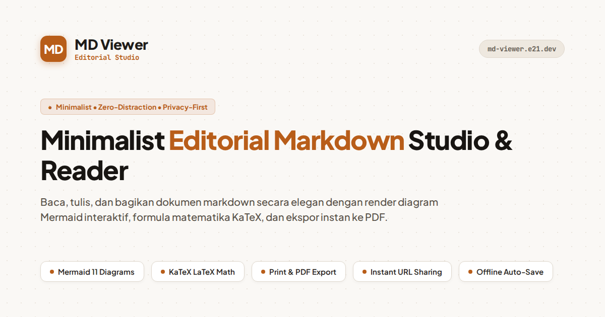

# MD Viewer

A minimalist Markdown editor and reader with native math, Mermaid diagrams, and instant zero-account link sharing.

[](https://md-viewer.e21.dev)
[](LICENSE)
[](https://nodejs.org)
[](https://react.dev)
[](https://www.typescriptlang.org)



---

## Features

- **Reader & Split Views**: Seamlessly switch between reading mode, distraction-free editing, and synchronized split view.
- **Math & Diagrams**: Native rendering for KaTeX LaTeX formulas (`$...$` and `$$...$$`) and Mermaid diagrams (flowcharts, sequence, state, ER, class, Gantt).
- **Zero-Account Sharing**: Generate a short link (`/s/:id`) with an optional QR code in one click. No registration required.
- **Re-publish Shared Docs**: Authors receive an edit token saved locally in the browser/CLI, allowing you to update a shared document without changing its URL.
- **Multi-Format Export**: Export clean print-formatted PDFs, standalone offline HTML files, or raw Markdown.
- **Themes**: Paper (light), Charcoal (dark), and Sepia.
- **Command Palette**: Press `Cmd+K` / `Ctrl+K` for fast navigation, theme switching, and actions.
- **Terminal CLI (`mdv`)**: Publish and update documents directly from your terminal or shell pipelines.
- **Model Context Protocol (MCP)**: Built-in stdio MCP server for Claude Desktop, Cursor, and other AI coding assistants.

---

## Quickstart

### Prerequisites

- Node.js 22.5+ (uses native `node:sqlite`)
- npm or pnpm

### Development

```bash
git clone https://github.com/ekacahya21/md-viewer.git
cd md-viewer
npm install
npm run dev
```

Open [http://localhost:5173](http://localhost:5173) in your browser.

### Production Build

```bash
npm run build
node server.mjs
```

---

## Docker & Self-Hosting

A production-ready multi-stage `Dockerfile` is included:

```bash
# Build Docker image
docker build -t md-viewer .

# Run with persistent SQLite data directory
docker run -d \
  --name md-viewer \
  -p 3015:80 \
  -v $(pwd)/data:/data \
  --restart unless-stopped \
  md-viewer
```

---

## Command Line Tool (`mdv`)

`mdv` lets you publish markdown files or piped output directly from your terminal.

### Installation

```bash
curl -fsSL https://md-viewer.e21.dev/install.sh | bash
```

### Usage

```bash
# Publish a local file (title auto-detected from first heading)
mdv README.md

# Publish with custom title and expiration
mdv notes.md -t "Project Roadmap" -e 7d

# Pipe from standard input
cat draft.md | mdv
git diff | mdv -t "Current Diff"

# Update an existing document using your saved edit token
mdv -u abc1234 updated.md

# List your recent uploads
mdv --list
```

---

## Model Context Protocol (MCP)

`mdv` includes a built-in MCP server that allows AI assistants to publish, read, and update shared Markdown documents.

### Claude Desktop

Add to your `claude_desktop_config.json`:

```json
{
  "mcpServers": {
    "md-viewer": {
      "command": "mdv",
      "args": ["--mcp"]
    }
  }
}
```

### Cursor

Add to `.cursor/mcp.json` in your workspace:

```json
{
  "mcpServers": {
    "md-viewer": {
      "command": "mdv",
      "args": ["--mcp"]
    }
  }
}
```

Run `mdv mcp config` in your terminal for system-specific path suggestions.

---

## Configuration

Copy `.env.example` to `.env` to customize settings:

```bash
cp .env.example .env
```

| Variable | Default | Description |
| :--- | :--- | :--- |
| `PORT` | `80` | Port for the Node.js production server |
| `DB_PATH` | `/data/shared_docs.db` | Path to the SQLite database file |
| `VIEW_SALT` | `md-viewer-view-salt-2026` | Salt used to hash visitor IP for view deduplication |
| `GOOGLE_SITE_VERIFICATION` | `""` | Optional Google Search Console verification meta tag |
| `LOCAL_LLM_HOST` | `http://127.0.0.1:20128/v1` | Optional OpenAI-compatible endpoint for AI summary |
| `LOCAL_LLM_KEY` | `""` | Optional API key for LLM endpoint |
| `LOCAL_LLM_MODEL` | `ag/gemini-3.7-flash-low` | LLM model name for document summarization |

---

## Testing

```bash
# Run unit and integration tests (Node 22 test runner)
npm test

# Run linter
npm run lint

# Run type check
npx tsc --noEmit
```

---

## Contributing

Contributions are welcome. Please see [CONTRIBUTING.md](CONTRIBUTING.md) for details on development workflow and coding standards.

---

## License

This project is open source and available under the [MIT License](LICENSE).
